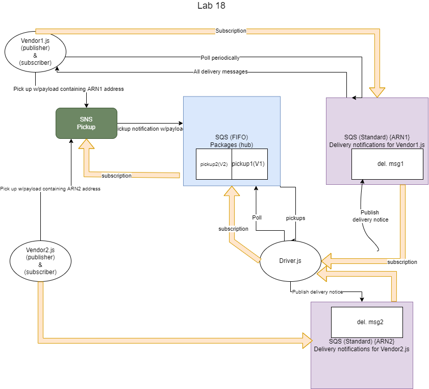

# caps-cloud

Version 1.0.0

## Description

CAPS, but this time using AWS SNS and AWS SQS services.

This is an app that simulates the deliivery of packages and sending delivery notifications. It is using AWS SNS and SQS services to track the order of packages being received and delivered. The system can work with multiple vendors and drivers.

## Authors

Ayrat Gimranov
Jeremy Brazell

## Collaborators

Alex White

## Resources

[CodeFellows 401-JS Lab 19 starter code](https://github.com/codefellows/seattle-javascript-401n19/tree/main/class-19/demo)

[AWS DOCS](https://docs.aws.amazon.com/)

[sqs-Consumer](https://www.npmjs.com/package/sqs-consumer)

[sqs-publisher](https://github.com/bbc/sqs-producer)

## To Start

There are two folders within the root folder: `driver` and `vendor`. Each folder represents a separate app. `vendor` folder contains two files: `toys-r-us.js` and `apple.js`, that each represent a store and need to be started up separately. `driver` folder also contains two files: `fedex.js` and `ups.js`, that each represent a delivery service and need to be started up separately.

Run these apps in any order preferably on a split tab in terminal. 

- Vendors will publish several PICK-UP requests for 30-40 seconds and will be listening for delivery notifications from drivers at the same time.
- Drivers will grab and deliver one package at a time from a AWS SQS FIFO queue (with 7 seconds interval between pick-up and delivery. Once a delivery is complete, driver will poll the queue for the next delivery.

Apps do not have to run at the same time. Vendors can log on, place orders and log off. Drivers can log on later, deliver those packages and log off as well. When vendors log on the next time, they will get notifications of completed deliveries.

If both drivers and vendors are logged on at the same, the driver will start carrying out deliveries as soon they are entered.

## UML

## Install

Run `npm i` in folders: "vendor" and "driver"